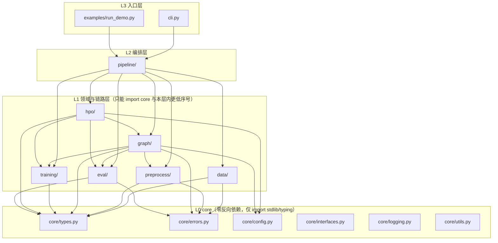
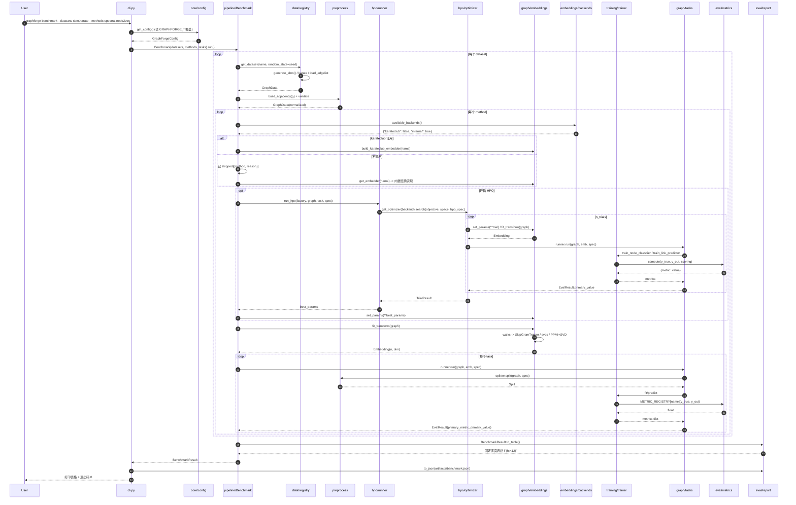
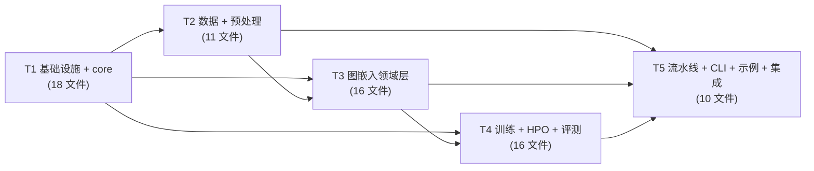

# GraphForge 系统架构设计 & 任务分解

> 版本：v1.0 · 架构师：高见远（Gao） · 域：Graph Representation Learning
> 包名 `graphforge` · 仓库 `cjx0712/graphforge` · 目标环境 Windows / Python 3.13.14 / win-amd64

---

## 0. 结论先行

| 项 | 结论 |
|---|---|
| 架构形态 | **单进程、分层单向无环**的函数式管线：CLI → Pipeline → {data, preprocess, graph, training, hpo, eval} → core。`core` 零反向依赖。 |
| 三大能力 | Node Classification、Link Prediction、Embedding Benchmark，统一 `TaskRunner` 接口 + 统一 `EvalResult` 结构 |
| 统一分数方向 | **全部指标一律"越大越好"**（`direction=+1`），跨模型/跨任务可直接排序比较 |
| SOTA 策略 | **优先复用开源，强制优雅降级**：`karateclub` / `node2vec` / `optuna` 均走 `try/except + available_*() 探测`；不可用时自动降级到内置经典算法复现或自研 Grid/Random Search |
| 内置算法 | 仅在开源后端不可用时启用，且只复现**经典论文算法**（node2vec 2016 / DeepWalk 2014 / Laplacian Eigenmaps 2003 / GraRep 2015），理由见 §3 |
| 任务数 | **5 个（T1–T5）**，T1 为基础设施，T5 为集成收尾 |
| 实测后端（已定论） | **optuna ✅ 装通（5.0.0）**；**karateclub ❌ 安装失败**（实测 7m05s，`metadata-generation-failed` @ numpy）；**node2vec ❌ 同因失败**（依赖 gensim → 要求 numpy<2 → py3.13 无 wheel → 源码构建 numpy 失败）。详见 §1.1 |

---

## 1. 环境与后端可用性（实测）

探测命令（venv 解释器）：
```
C:/Users/Administrator/.workbuddy/binaries/python/envs/graphforge/Scripts/python.exe
```

> **实测已定论，工程师无需重跑探测**：
> - `pip install optuna` → ✅ 成功（3s）。
> - `pip install node2vec karateclub` → ❌ 失败（7m05s，`metadata-generation-failed × numpy`）。
> - 失败后**复核环境完好**：numpy 2.5.3 / scipy 1.18.1 / sklearn 1.9.1 / networkx 3.7 / pandas 3.0.6 / pytest 9.1.1 / optuna 5.0.0 / joblib 1.6.0 全部可 import，无需重建 venv。
> - **禁止再次尝试安装 karateclub / node2vec / gensim / numba**（会触发 numpy 源码构建，耗时且必失败）。

### 1.1 依赖实测矩阵

| 库 | 用途 | 实测结果 | 是否可选 | 降级方案 |
|---|---|---|---|---|
| numpy 2.5.3 | 张量/embedding 矩阵 | ✅ 可用 | 核心 | — |
| scipy 1.18.1 | `sparse.csr_matrix`、`svds`/`eigsh` 谱分解 | ✅ 可用（`svds` 已验证 karate 图通过） | 核心 | — |
| scikit-learn 1.9.1 | 下游分类器 + 全部评估指标 | ✅ 可用（`accuracy/f1/roc_auc/average_precision` 全通过） | 核心 | — |
| networkx 3.7 | 图结构、合成图、文件读取 | ✅ 可用（SBM/karate/grid/稀疏转换全通过） | 核心 | — |
| pandas 3.0.6 | CSV 载入 | ✅ 可用 | 核心 | 可选（纯 csv 模块兜底，见 §11） |
| joblib 1.6.0 | 并行/缓存 | ✅ 可用（sklearn 自带） | 核心 | — |
| pytest 9.1.1 | 单测 | ✅ 可用 | 开发 | — |
| **optuna 5.0.0** | HPO（TPE） | ✅ **已安装并跑通**（8 trials、`TPESampler(seed=42)` 可复现） | **可选** | 自研 `RandomSearchOptimizer` / `GridSearchOptimizer` |
| **karateclub 1.3.3** | Node2Vec/DeepWalk/Diff2Vec 官方实现 | ❌ **确认为不可用（已实测安装失败）**：PyPI 仅提供 `.tar.gz`（sdist，64KB）；`pip install karateclub` 运行 **7m05s** 后失败于 `error: metadata-generation-failed × numpy` —— 其依赖链（numba / gensim / 旧版 scipy）要求 `numpy<2`，而 py3.13/win-amd64 无对应 wheel，pip 回退到**源码构建 numpy**，meson 构建失败。**结论：本环境禁止再尝试安装。** | **可选** | 内置经典算法复现（§3） |
| **node2vec 0.5.0** | 官方 node2vec | ❌ **确认为不可用**：虽有 `py3-none-any.whl`（7.2KB），但依赖 `gensim` → gensim 要求 `numpy<2` → 与 karateclub 同批次失败 | **可选** | 内置 `Node2VecEmbedder` |
| gensim | word2vec 后端 | ❌ 不可用（同上，numpy<2 约束） | 可选 | 自研 `SkipGramTrainer`（numpy 负采样 SGD） |
| torch / dgl / PyG / stellargraph / igraph / numba / matplotlib / tqdm | 深度图神经网络等 | ❌ 全部不可用 | 排除 | 本项目**不引入**任何 GNN 依赖 |

### 1.2 关键 API 实测（工程师可直接照抄）

| 调用 | 实测结论 |
|---|---|
| `nx.stochastic_block_model(sizes, p, seed=...)` | ✅ 400 节点 4 社区 **0.015s**；节点自带 `block` 属性 → 直接当标签用 |
| `nx.karate_club_graph()` | ✅ 34 节点 78 边；节点属性 `club` |
| `nx.grid_2d_graph(10,10)` | ✅ 100 节点 180 边 |
| `nx.to_scipy_sparse_array(g, format='csr')` | ✅ 返回 `(34,34) int64`；**注意 networkx 3.x 已移除 `to_scipy_sparse_matrix`** |
| `nx.laplacian_matrix(g)` | ✅ 可用 |
| `scipy.sparse.linalg.svds(A.astype(float), k=4, random_state=0)` | ✅ 返回 `U(34,4) S(4,) Vt(4,34)`；**必须显式传 `random_state` 才可复现** |
| `nx.LFR_benchmark_graph(n=100, tau1=3, tau2=1.5, mu=0.1, average_degree=5, min_community=10, seed=42)` | ❌ **抛 `ExceededMaxIterations`**；换 `min_community=20` 等参数后**仍然长时间不返回（>120s 挂起）** |
| 纯 Python 随机游走 4000 条 × 80 步 | ✅ **0.165s** → 内置 random walk 性能完全可接受（配合 alias 采样可再快 3–5×） |
| `optuna.create_study(direction='maximize', sampler=TPESampler(seed=42))` | ✅ 8 trials 秒级完成，seed 固定可复现 |

> **硬性结论（写入 §10 踩坑清单）**：
> 1. **LFR 生成器禁止作为默认/测试路径**——会挂起。默认合成图用 **SBM**；LFR 仅在 `--synthetic lfr` 显式指定时启用，且必须带 `n<=100` + 重试上限 + **超时回退到 SBM**。
> 2. 所有 `svds/eigsh`、SBM、游走、负采样、estimator 构造，**必须显式传 `random_state`**。

---

## 2. 实现方案

### 2.1 核心技术难点与对策

| # | 难点 | 对策 |
|---|---|---|
| D1 | 三个任务（节点分类/链路预测/嵌入基准）指标口径不同，无法横向比较 | 统一 `EvalResult{metrics, primary_metric, primary_value}`，所有指标注册在 `METRIC_REGISTRY` 且 `direction=+1`；`eval/ranking.py` 只按 primary 排序 |
| D2 | 可选后端在 Windows/py3.13 装不上 | `graph/embeddings/backends.py` + `hpo/backends.py` 提供 `available_*()`；`Benchmark` 遇不可用后端**跳过并记 warning**，不中断 |
| D3 | 内置嵌入器必须与官方语义对齐但又不妄称 SOTA | 只复现经典论文算法，文档标注"经典算法复现、非 SOTA"；README 与 benchmark 表加 `backend` 列标明 `internal / karateclub` |
| D4 | 纯 numpy 实现 skip-gram 的收敛与速度 | 负采样 + SGD（Mikolov NIPS 2013），默认 `dim=128, walk_length=80, num_walks=10, window=10, epochs=1, lr=0.025, neg=5`；walk 用 alias table O(1) 采样 |
| D5 | 确定性可复现 | 所有随机入口吃 `random_state`；`core/utils.derive_seed(base, *tags)` 用 **hashlib**（禁止 `hash()`，Python 字符串 hash 有随机盐）派生分阶段 seed |
| D6 | 分层依赖被破坏（如 eval 反向 import graph） | 依赖方向强制：`core ← {data,preprocess,graph,training,hpo,eval} ← pipeline ← cli`。`core` 只允许 import stdlib + typing；单测 `test_layering.py` 静态扫描源码 import 断言无环 |

### 2.2 架构模式

- **整体**：Layered Pipeline（分层管线）+ Registry（注册表）+ Strategy（策略）模式。
- **领域层**：`Embedder` 用 **Template Method**（`BaseEmbedder` 固化 `fit_transform/get_params/set_params`，子类只实现 `_fit()`）。
- **任务层**：`TaskRunner` 策略模式，三个任务同签名。
- **HPO**：`Optimizer` 策略模式（optuna / grid / random 三实现同 Protocol）。
- **配置**：单例 `get_config()` + 环境变量覆盖（12-factor）。

### 2.3 选型依据表

| 库 | 用途 | 是否可选 | 为什么选它（依据） | 降级方案 |
|---|---|---|---|---|
| networkx 3.7 | 图结构、合成图 SBM/karate/grid、edgelist 读取 | 核心 | 纯 Python、无编译、社区标准；`stochastic_block_model` 自带 `block` 属性可直接作标签 | 无 |
| scipy.sparse | 邻接矩阵 CSR 存储、谱分解 `svds` | 核心 | Spectral/GraRep 需要大规模稀疏 SVD；CSR 是图算法事实标准 | 小规模退化为 `np.linalg` |
| scikit-learn 1.9.1 | LogisticRegression/RandomForest 下游分类器 + 全部指标 | 核心 | **禁止自研评估指标**（易错、递归坑）；sklearn 是评测口径的事实标准 | 无（核心） |
| numpy | embedding 矩阵、SGD 训练、alias 采样 | 核心 | 内置算法的唯一数值后端 | 无 |
| pandas 3.0.6 | CSV（边表/标签/特征）载入 | 核心 | `read_csv` 稳健 | 内置 `csv` 模块兜底（loaders 内置 fallback） |
| pytest 9.1.1 | 单元测试 | 开发 | 用户 SOP 指定 | 无 |
| optuna 5.0.0 | 超参搜索 TPE | **可选** | 已实测装通；TPE 比网格搜索样本效率高 | 自研 `GridSearchOptimizer` / `RandomSearchOptimizer` |
| karateclub 1.3.3 | 官方 Node2Vec/DeepWalk | **可选** | "复用顶级开源"的首选；**但本环境实测安装失败（7m05s，numpy 源码构建失败）** | 内置经典算法复现（§3） |
| node2vec 0.5.0 | 官方 node2vec | **可选** | 论文作者参考实现；**本环境实测失败**（gensim→numpy<2） | 内置 `Node2VecEmbedder` |

---

## 3. 经典算法复现的书面理由（合规声明）

> **原则：复用顶级开源优先，禁止自研 SOTA。** 内置实现仅在开源后端不可用时启用，且**只复现已发表 >8 年的经典基线算法**作为 benchmark 对照，不声称任何 SOTA。

| 内置实现 | 对应论文 | 复现理由（书面） |
|---|---|---|
| `Node2VecEmbedder` | **Grover & Leskovec, "node2vec: Scalable Feature Learning for Networks", KDD 2016** | karateclub（sdist-only）与 node2vec（依赖 gensim）在 Windows/py3.13 均无可用 wheel，实测安装失败。node2vec 是图嵌入领域**最基础的对照基线**，缺失则 benchmark 无意义。故按原论文 §3 实现二阶偏置随机游走（返回参数 `p`、出入参数 `q`）+ 负采样 skip-gram。 |
| `DeepWalkEmbedder` | **Perozzi et al., "DeepWalk: Online Learning of Social Representations", KDD 2014** + 训练部分用 **Mikolov et al., NIPS 2013** 负采样 | 同上。原论文使用 hierarchical softmax；本实现改用 **负采样（negative sampling, k=5）**，这是原作者后续 word2vec 工作的标准等价替代，需在 docstring 中显式标注该差异。 |
| `SpectralEmbedder` | **Belkin & Niyogi, "Laplacian Eigenmaps for Dimensionality Reduction and Data Representation", Neural Computation 2003** | 谱嵌入是图嵌入的解析式经典方法，实现即"归一化图拉普拉斯的前 k 个最小非平凡特征向量"，`scipy.sparse.linalg` 直接可算，无第三方依赖。 |
| `GraRepEmbedder` | **Cao et al., "GraRep: Learning Graph Representations with Global Structural Information", CIKM 2015** | k 步转移矩阵的 PPMI + SVD 拼接，纯 `scipy` 可实现，是"全局结构信息"类的经典对照基线。 |

**内置实现的边界约束（写进 README 与 docstring）**：
1. 只做**基线对照**，README/benchmark 输出中 `backend` 列必须标注 `internal`。
2. 不做任何性能宣称；不得加入近 3 年的新方法。
3. karateclub 可用时 `GRAPHFORGE_EMBED_BACKEND=karateclub` 优先走官方实现，内置实现仅作 fallback。

---

## 4. 分层依赖与调用约束



**依赖方向规则（硬性，箭头 = "依赖于"）**
```
cli / examples  →  pipeline  →  { data, preprocess, graph, training, hpo, eval }  →  core

层内允许：
  data        → core
  preprocess  → core
  training    → core
  eval        → core                       （eval 只依赖 core + sklearn，不依赖 graph）
  graph       → { core, preprocess, training, eval }   （embeddings 用 build_adjacency；tasks 用 estimator + metrics）
  hpo         → { core, graph, training, eval }

禁止： core → 任何上层；eval → graph/pipeline/cli；graph → pipeline/cli；任何循环 import
断言： tests/test_layering.py 静态扫描上述规则
```

---

## 5. 完整文件列表

### 5.1 根目录

| 路径 | 职责（一句话） |
|---|---|
| `README.md` | 项目说明、快速开始、CLI 用法、benchmark 示例输出、合规声明（内置算法非 SOTA） |
| `requirements.txt` | 核心依赖 + 可选依赖（分注释块）声明 |
| `requirements.lock.txt` | 当前 venv 实测可运行的**精确版本锁定**（供复现） |
| `pyproject.toml` | 包元数据（`name=graphforge`）+ pytest 配置；支持 `pip install -e .` |
| `Makefile` | `install / test / lint / demo / bench / clean` 快捷目标 |
| `Dockerfile` | `python:3.11-slim` 基础镜像，安装 lock 依赖并跑 demo |
| `.gitignore` | 忽略 `__pycache__/、artifacts/、.pytest_cache/、*.pyc、venv/` 等 |
| `docs/architecture.md` | 本文档 |
| `docs/class-diagram.mermaid` | 类图源码 |
| `docs/sequence-diagram.mermaid` | 时序图源码 |

### 5.2 `graphforge/` 包

| 路径 | 职责 |
|---|---|
| `graphforge/__init__.py` | 版本号 `__version__`、顶层导出 `available_backends()` / `run_pipeline()` / 常用类型 |
| `graphforge/py.typed` | PEP 561 类型标记（空文件） |
| `graphforge/cli.py` | argparse 入口：`doctor / list-datasets / list-methods / embed / run / benchmark` 六个子命令 |

#### `graphforge/core/`（L0，零反向依赖）

| 路径 | 职责 |
|---|---|
| `core/__init__.py` | 导出 types / errors / config / interfaces 的公共符号 |
| `core/types.py` | 全部 dataclass 数据模型：`GraphData / Embedding / TaskSpec / Split / EvalResult / BenchmarkResult / TrialResult / HPOSpec / ParamSpec / SearchSpace`，以及枚举 `TaskType / BackendStatus / SplitStrategy` |
| `core/errors.py` | 错误体系：`GraphForgeError` 基类 + E101–E505 具体错误码与 `raise_error()` 工厂 |
| `core/config.py` | `GraphForgeConfig` dataclass + `GRAPHFORGE_*` 环境变量覆盖 + `get_config()/set_config()/reset_config()` |
| `core/interfaces.py` | 全部 Protocol：`GraphSource / Embedder / TaskRunner / Splitter / EstimatorFactory / Scorer / Optimizer / Reporter` |
| `core/logging.py` | `get_logger(name)`（stdlib logging，库内不装 handler）、`setup_logging(level)`（仅 CLI 调用） |
| `core/utils.py` | `derive_seed()`（hashlib 派生）、`make_rng()`、`timer()` 上下文、`ensure_dir()`、`stable_json()` |

#### `graphforge/data/`

| 路径 | 职责 |
|---|---|
| `data/__init__.py` | 导出合成生成器与载入器 |
| `data/synthetic.py` | `generate_sbm / generate_karate / generate_grid / generate_lfr(带超时回退)`，全部吃 `random_state` |
| `data/loaders.py` | `load_edgelist / load_edge_csv / load_label_csv / load_feature_csv`，统一产出 `GraphData` |
| `data/registry.py` | `DATASET_REGISTRY`、`list_datasets()`、`get_dataset(name, **kw)` |

#### `graphforge/preprocess/`

| 路径 | 职责 |
|---|---|
| `preprocess/__init__.py` | 导出 build/split/features 公共 API |
| `preprocess/build.py` | `build_adjacency()`：无向对称化、去自环、CSR 化、度归一化；`largest_connected_component()` |
| `preprocess/split.py` | `Split` 构造：节点分层划分 `StratifiedNodeSplitter`、边划分 `EdgeSplitter`（含负边采样，`negative_ratio`） |
| `preprocess/features.py` | `NodeFeatureBuilder`：degree / onehot-degree / clustering / none，供基线特征与拼接用 |

#### `graphforge/graph/`（领域层）

| 路径 | 职责 |
|---|---|
| `graph/__init__.py` | 导出 embedders 与 tasks |
| `graph/embeddings/__init__.py` | 导出全部嵌入器与注册表函数 |
| `graph/embeddings/base.py` | `BaseEmbedder` 抽象基类：Template Method 固化 `fit/transform/fit_transform/get_params/set_params`，实现**保留参数防泄漏校验** |
| `graph/embeddings/walks.py` | `uniform_random_walk()`、`biased_random_walk()`（node2vec p/q + **alias table O(1) 采样**）、`alias_setup/draw` |
| `graph/embeddings/skipgram.py` | `SkipGramTrainer`：纯 numpy 负采样 skip-gram（SGD），供 DeepWalk/Node2Vec 共用 |
| `graph/embeddings/spectral.py` | `SpectralEmbedder`：拉普拉斯/邻接谱嵌入（Belkin 2003），基于 `scipy.sparse.linalg` |
| `graph/embeddings/deepwalk.py` | `DeepWalkEmbedder`：均匀游走 + skip-gram（Perozzi 2014） |
| `graph/embeddings/node2vec.py` | `Node2VecEmbedder`：p/q 偏置游走 + skip-gram（Grover 2016） |
| `graph/embeddings/grarep.py` | `GraRepEmbedder`：k 步 PPMI + SVD 拼接（Cao 2015） |
| `graph/embeddings/backends.py` | `available_backends()` / `karateclub_status()` / `build_karateclub_embedder()`，全部 try/except 懒加载 |
| `graph/embeddings/registry.py` | `EMBEDDER_REGISTRY`、`list_embedders()`、`get_embedder(name, **params)` |
| `graph/tasks/__init__.py` | 导出任务 runner 与注册表 |
| `graph/tasks/base.py` | `BaseTaskRunner`：固化 `run() -> EvalResult` 的骨架（校验 → 划分 → 训练 → 评估 → 计时 → 封装） |
| `graph/tasks/node_classification.py` | `NodeClassificationRunner`：embedding/特征 → 分类器 → accuracy / macro-F1 |
| `graph/tasks/link_prediction.py` | `LinkPredictionRunner`：边特征（hadamard/avg/l2/concat）→ 分类器 → ROC-AUC / AP |
| `graph/tasks/embedding_benchmark.py` | `EmbeddingBenchmarkRunner`：用下游任务指标衡量 embedding 质量（统一口径） |
| `graph/tasks/registry.py` | `TASK_REGISTRY`、`get_task(name)` |

#### `graphforge/training/`

| 路径 | 职责 |
|---|---|
| `training/__init__.py` | 导出 estimator 工厂与训练函数 |
| `training/estimators.py` | `ESTIMATOR_REGISTRY`、`make_estimator(name, params, random_state)`——**构造器单独传内部参数，避免 `**params` 泄漏** |
| `training/cv.py` | `cross_val_scores()`：`StratifiedKFold(n_splits, shuffle=True, random_state=...)` |
| `training/trainer.py` | `train_node_classifier()` / `train_link_predictor()`：fit → predict/predict_proba → 交 eval 计算 |

#### `graphforge/hpo/`

| 路径 | 职责 |
|---|---|
| `hpo/__init__.py` | 导出 `run_hpo()`、`get_optimizer()`、`available_optimizers()` |
| `hpo/space.py` | `ParamSpec`（float/int/log_float/categorical）+ `SearchSpace`（含 `sample(rng)` 供自研搜索） |
| `hpo/backends.py` | `available_optimizers()` → `{"optuna": bool, "grid": True, "random": True}` |
| `hpo/optimizer.py` | `GridSearchOptimizer` / `RandomSearchOptimizer` / `OptunaOptimizer`（懒 import） |
| `hpo/runner.py` | `run_hpo()`：objective = 建 embedder → 嵌入 → 跑 task → 返回 primary（越大越好） |

#### `graphforge/eval/`

| 路径 | 职责 |
|---|---|
| `eval/__init__.py` | 导出 metrics / ranking / report |
| `eval/metrics.py` | `METRIC_REGISTRY`（name → (func, direction)）；**sklearn 函数一律 `_sk_` 前缀别名导入，杜绝递归** |
| `eval/ranking.py` | `rank_results()`：统一按 `direction` 归一后降序排名 |
| `eval/report.py` | `render_table()`（固定宽度 `f"{h:<12}"`）、`BenchmarkReport.to_json()/to_markdown()/print()` |

#### `graphforge/pipeline/`

| 路径 | 职责 |
|---|---|
| `pipeline/__init__.py` | 导出 `GraphPipeline` / `Benchmark` |
| `pipeline/pipeline.py` | `GraphPipeline`：单条链路 `dataset → preprocess → (hpo) → embed → task → eval`，`run() -> EvalResult` |
| `pipeline/benchmark.py` | `Benchmark`：datasets × methods × tasks 网格评测，跳过不可用后端，产出 `BenchmarkResult` |

#### `examples/` 与 `tests/`

| 路径 | 职责 |
|---|---|
| `examples/run_demo.py` | 端到端演示：SBM+karate → 4 种嵌入 → 3 个任务 → 落盘 `artifacts/benchmark.json` 与 `artifacts/report.md`，固定 `seed=42` |
| `tests/conftest.py` | 公共 fixture：`small_sbm()`、`karate()`、`tmp_artifacts`、`fixed_seed` |
| `tests/test_core_types.py` | `GraphData/Embedding/EvalResult` 构造、校验、`to_networkx/from_networkx` 往返 |
| `tests/test_core_config.py` | 默认值、ENV 覆盖、类型解析、`reset_config` |
| `tests/test_core_errors.py` | 错误码唯一性、携带 code/context |
| `tests/test_data_synthetic.py` | SBM/karate/grid 确定性（同 seed 同图）；LFR 回退 |
| `tests/test_data_loaders.py` | edgelist/csv/标签/特征载入与错误码 |
| `tests/test_preprocess.py` | 邻接对称化、去自环、分层划分比例、负边不与正边重叠 |
| `tests/test_embeddings_walks.py` | 游走长度/起点、p/q 偏置统计、alias 采样分布 |
| `tests/test_embeddings.py` | 4 个嵌入器 shape、确定性、`get_params/set_params`、保留参数拒绝 |
| `tests/test_backend_probe.py` | `available_backends()/available_optimizers()` 恒定返回不抛异常 |
| `tests/test_tasks.py` | 三任务产出 `EvalResult`、primary 正确、指标方向 |
| `tests/test_training.py` | estimator 工厂、CV 折数、参数不泄漏 |
| `tests/test_hpo.py` | grid/random 必跑；optuna 存在时才跑（`skipif`）；返回 `TrialResult` |
| `tests/test_eval_metrics.py` | 指标值与 sklearn 对齐、方向全为 +1 |
| `tests/test_pipeline.py` | `GraphPipeline.run()` 端到端 + 中间态可查 |
| `tests/test_cli.py` | 六个子命令退出码 0；`benchmark` 输出表头对齐 |
| `tests/test_determinism.py` | 同 seed 两次 `run_demo` 结果完全一致 |
| `tests/test_layering.py` | 静态扫描：core 不 import 上层；无环 |

> 用例总数预估 **≥ 40**（远超 SOP 要求的 15 个）。

---

## 6. 数据结构与接口清单

### 6.1 数据模型（`core/types.py`）

```python
# ---------- 枚举 ----------
class TaskType(str, Enum):
    NODE_CLASSIFICATION = "node_classification"
    LINK_PREDICTION     = "link_prediction"
    EMBEDDING_BENCHMARK = "embedding_benchmark"

class BackendStatus(str, Enum):
    AVAILABLE   = "available"
    UNAVAILABLE = "unavailable"

class SplitStrategy(str, Enum):
    STRATIFIED = "stratified"
    RANDOM     = "random"
    EDGE       = "edge"

# ---------- 图 ----------
@dataclass(frozen=True)
class GraphData:
    adjacency: "sp.csr_matrix"            # (n, n) 对称、无自环、CSR
    node_ids: List[str]                   # 稳定顺序的节点标识
    node_labels: Optional[np.ndarray]     # (n,) int；-1 表示无标签
    node_features: Optional[np.ndarray]   # (n, d) float
    is_directed: bool = False
    name: str = "graph"
    metadata: Dict[str, Any] = field(default_factory=dict)

    # 属性：num_nodes / num_edges / has_labels
    # 方法：to_networkx() -> nx.Graph
    #       classmethod from_networkx(g, label_attr=None, feature_attr=None) -> GraphData
    #       validate() -> None                       # 违规抛 E1xx/E2xx
    #       subgraph(node_index: np.ndarray) -> GraphData

# ---------- 嵌入 ----------
@dataclass(frozen=True)
class Embedding:
    matrix: np.ndarray                    # (n, dim)
    node_ids: List[str]
    method: str                           # "node2vec" / "deepwalk" / ...
    backend: str                          # "internal" | "karateclub"
    params: Dict[str, Any] = field(default_factory=dict)

    # 属性：dim / num_nodes
    # 方法：align(node_ids: List[str]) -> Embedding
    #       validate() -> None

# ---------- 任务与划分 ----------
@dataclass(frozen=True)
class TaskSpec:
    task: TaskType
    train_ratio: float = 0.6
    val_ratio: float   = 0.2
    test_ratio: float  = 0.2
    n_splits: int = 5
    random_state: int = 42
    scoring: Tuple[str, ...] = ("accuracy", "macro_f1")   # 节点分类默认
    primary_metric: Optional[str] = None                  # None → 取 scoring[0] 的 primary
    negative_ratio: float = 1.0                           # 链路预测负样本倍率
    edge_op: str = "hadamard"                             # hadamard|average|l2|concat
    estimator: str = "logistic_regression"
    estimator_params: Dict[str, Any] = field(default_factory=dict)
    use_cv: bool = False

@dataclass(frozen=True)
class Split:
    train_idx: np.ndarray
    val_idx: np.ndarray
    test_idx: np.ndarray
    y: Optional[np.ndarray] = None
    extra: Dict[str, Any] = field(default_factory=dict)   # 链路预测：pos/neg 边与标签

# ---------- 结果 ----------
@dataclass
class EvalResult:
    task: TaskType
    dataset: str
    method: str
    backend: str
    metrics: Dict[str, float]
    primary_metric: str
    primary_value: float
    n_samples: int
    elapsed_sec: float
    params: Dict[str, Any] = field(default_factory=dict)

    # 方法：as_row() -> Dict[str, Any]

@dataclass
class BenchmarkResult:
    name: str
    created_at: str
    config: Dict[str, Any]
    rows: List[EvalResult]
    skipped: List[Dict[str, str]] = field(default_factory=list)  # {"method","reason"}

    # 方法：best(metric=None) -> EvalResult
    #       to_dict() -> dict
    #       to_json(path: Path) -> None
    #       to_table() -> str

# ---------- HPO ----------
@dataclass(frozen=True)
class ParamSpec:
    name: str
    kind: str                      # "float" | "int" | "log_float" | "categorical"
    low: Optional[float] = None
    high: Optional[float] = None
    choices: Optional[Sequence[Any]] = None
    default: Optional[Any] = None

@dataclass(frozen=True)
class SearchSpace:
    params: Tuple[ParamSpec, ...]
    # 方法：names / sample(rng) -> Dict[str, Any] / grid(n) -> List[Dict[str, Any]]

@dataclass(frozen=True)
class HPOSpec:
    backend: str = "auto"          # auto|optuna|random|grid|none
    n_trials: int = 20
    direction: str = "maximize"    # 统一：只 maximize
    random_state: int = 42
    timeout_sec: Optional[float] = None

@dataclass
class TrialResult:
    best_params: Dict[str, Any]
    best_value: float
    n_trials: int
    backend: str
    history: List[Dict[str, Any]] = field(default_factory=list)
```

### 6.2 Protocol 接口（`core/interfaces.py`）

```python
class GraphSource(Protocol):
    def load(self, **kwargs: Any) -> GraphData: ...

class Embedder(Protocol):
    name: str
    backend: str
    def fit(self, graph: GraphData) -> "Embedder": ...
    def transform(self) -> Embedding: ...
    def fit_transform(self, graph: GraphData) -> Embedding: ...
    def get_params(self) -> Dict[str, Any]: ...
    def set_params(self, **params: Any) -> "Embedder": ...   # 遇到保留参数抛 E303
    def default_space(self) -> SearchSpace: ...

class Splitter(Protocol):
    def split(self, graph: GraphData, spec: TaskSpec) -> Split: ...

class EstimatorFactory(Protocol):
    def __call__(self, name: str, params: Dict[str, Any], random_state: int) -> Any: ...

class Scorer(Protocol):
    name: str
    direction: int                      # 恒为 +1
    def __call__(self, y_true: np.ndarray, y_out: np.ndarray) -> float: ...

class TaskRunner(Protocol):
    task: TaskType
    def run(self, graph: GraphData, embedding: Optional[Embedding], spec: TaskSpec) -> EvalResult: ...

class Optimizer(Protocol):
    name: str
    def search(self, objective: Callable[[Dict[str, Any]], float],
               space: SearchSpace, spec: HPOSpec) -> TrialResult: ...

class Reporter(Protocol):
    def render(self, result: BenchmarkResult) -> str: ...
```

### 6.3 关键类签名

```python
# graph/embeddings/base.py
class BaseEmbedder(ABC):
    RESERVED = frozenset({"dim", "n_classes", "num_nodes", "n_nodes",
                          "random_state", "backend", "name"})
    def __init__(self, dim: int = 128, random_state: int = 42, **hyper: Any) -> None: ...
    def fit(self, graph: GraphData) -> "BaseEmbedder": ...      # 调 self._fit(graph)
    def transform(self) -> Embedding: ...
    def fit_transform(self, graph: GraphData) -> Embedding: ...
    def get_params(self) -> Dict[str, Any]: ...                 # 只返回超参，不含 dim/random_state
    def set_params(self, **params) -> "BaseEmbedder": ...       # 命中 RESERVED → E303
    def default_space(self) -> SearchSpace: ...
    @abstractmethod
    def _fit(self, graph: GraphData) -> np.ndarray: ...         # 返回 (n, dim)

# graph/embeddings/node2vec.py
class Node2VecEmbedder(BaseEmbedder):
    def __init__(self, dim=128, walk_length=80, num_walks=10, window=10,
                 p=1.0, q=1.0, epochs=1, learning_rate=0.025, negative=5,
                 random_state=42) -> None: ...

# graph/tasks/base.py
class BaseTaskRunner(ABC):
    task: TaskType
    def run(self, graph, embedding, spec) -> EvalResult: ...    # 模板方法
    @abstractmethod
    def _evaluate(self, graph, embedding, spec, split) -> Dict[str, float]: ...

# pipeline/pipeline.py
class GraphPipeline:
    def __init__(self, dataset="sbm", task="node_classification", method="node2vec",
                 spec=None, hpo=None, config=None) -> None: ...
    def run(self) -> EvalResult: ...
    def dry_run(self) -> Dict[str, Any]: ...                    # 打印计划，不执行

# pipeline/benchmark.py
class Benchmark:
    def __init__(self, datasets=("sbm", "karate"), methods=None, tasks=None,
                 spec=None, config=None) -> None: ...
    def run(self) -> BenchmarkResult: ...                       # 跳过不可用后端
```

### 6.4 类图

```mermaid
classDiagram
    class GraphData {
        +csr_matrix adjacency
        +List~str~ node_ids
        +Optional~ndarray~ node_labels
        +Optional~ndarray~ node_features
        +bool is_directed
        +str name
        +int num_nodes()
        +int num_edges()
        +to_networkx() Graph
        +from_networkx(g) GraphData
        +validate() None
    }
    class Embedding {
        +ndarray matrix
        +List~str~ node_ids
        +str method
        +str backend
        +Dict params
        +int dim()
        +align(ids) Embedding
    }
    class TaskSpec {
        +TaskType task
        +float train_ratio
        +float val_ratio
        +float test_ratio
        +int n_splits
        +int random_state
        +Tuple scoring
        +str primary_metric
    }
    class Split {
        +ndarray train_idx
        +ndarray val_idx
        +ndarray test_idx
        +Dict extra
    }
    class EvalResult {
        +TaskType task
        +str dataset
        +str method
        +Dict metrics
        +str primary_metric
        +float primary_value
        +as_row() Dict
    }
    class BenchmarkResult {
        +List~EvalResult~ rows
        +List skipped
        +best(metric) EvalResult
        +to_json(path) None
        +to_table() str
    }
    class SearchSpace {
        +Tuple~ParamSpec~ params
        +sample(rng) Dict
        +grid(n) List
    }
    class TrialResult {
        +Dict best_params
        +float best_value
        +int n_trials
        +str backend
    }

    class GraphSource {
        <<Protocol>>
        +load(kwargs) GraphData
    }
    class Embedder {
        <<Protocol>>
        +str name
        +fit(graph) Embedder
        +transform() Embedding
        +fit_transform(graph) Embedding
        +get_params() Dict
        +set_params(params) Embedder
        +default_space() SearchSpace
    }
    class TaskRunner {
        <<Protocol>>
        +TaskType task
        +run(graph, embedding, spec) EvalResult
    }
    class Optimizer {
        <<Protocol>>
        +str name
        +search(objective, space, spec) TrialResult
    }

    class BaseEmbedder {
        <<Abstract>>
        +int dim
        +int random_state
        +fit(graph) BaseEmbedder
        +fit_transform(graph) Embedding
        +set_params(params) BaseEmbedder
        -_fit(graph) ndarray
    }
    class SpectralEmbedder
    class DeepWalkEmbedder
    class Node2VecEmbedder
    class GraRepEmbedder
    class SkipGramTrainer {
        +train(walks, dim, window, neg, lr, epochs, rng) ndarray
    }

    class BaseTaskRunner {
        <<Abstract>>
        +run(graph, embedding, spec) EvalResult
        -_evaluate(...) Dict
    }
    class NodeClassificationRunner
    class LinkPredictionRunner
    class EmbeddingBenchmarkRunner

    class GraphPipeline {
        +str dataset
        +str method
        +TaskSpec spec
        +run() EvalResult
        +dry_run() Dict
    }
    class Benchmark {
        +run() BenchmarkResult
    }
    class OptunaOptimizer {
        +search(objective, space, spec) TrialResult
    }
    class GridSearchOptimizer
    class RandomSearchOptimizer

    BaseEmbedder ..|> Embedder
    SpectralEmbedder --|> BaseEmbedder
    DeepWalkEmbedder --|> BaseEmbedder
    Node2VecEmbedder --|> BaseEmbedder
    GraRepEmbedder --|> BaseEmbedder
    DeepWalkEmbedder --> SkipGramTrainer : uses
    Node2VecEmbedder --> SkipGramTrainer : uses
    BaseTaskRunner ..|> TaskRunner
    NodeClassificationRunner --|> BaseTaskRunner
    LinkPredictionRunner --|> BaseTaskRunner
    EmbeddingBenchmarkRunner --|> BaseTaskRunner
    GraphPipeline --> GraphSource : uses
    GraphPipeline --> Embedder : uses
    GraphPipeline --> TaskRunner : uses
    GraphPipeline --> Optimizer : optional
    GraphPipeline --> EvalResult : produces
    Benchmark --> GraphPipeline : uses
    Benchmark --> BenchmarkResult : produces
    OptunaOptimizer ..|> Optimizer
    GridSearchOptimizer ..|> Optimizer
    RandomSearchOptimizer ..|> Optimizer
    TaskRunner --> GraphData : consumes
    Embedder --> Embedding : produces
    TaskRunner --> Embedding : consumes
    TaskRunner --> TaskSpec : consumes
    BenchmarkResult o-- EvalResult
    SearchSpace o-- ParamSpec
```



---

## 7. 程序调用流程

### 7.1 主链路时序图（`benchmark` 命令）



### 7.2 单条管线（`run` 命令）简化流程

```
cli.run → GraphPipeline.run()
  ├─ 1. data.registry.get_dataset(dataset, random_state)        → GraphData
  ├─ 2. preprocess.build.build_adjacency + validate             → GraphData
  ├─ 3. hpo.runner.run_hpo (可选，backend=auto)                  → TrialResult.best_params
  ├─ 4. graph.embeddings.registry.get_embedder(method, **params).fit_transform → Embedding
  ├─ 5. graph.tasks.registry.get_task(task).run(graph, emb, spec) → EvalResult
  └─ 6. return EvalResult（CLI 打印 metrics 或 --out 落盘 json）
```

---

## 8. 任务分解（T1–T5）

> 规则：5 个任务，按依赖顺序；T1 为基础设施。T2/T3/T4 之间为**接口契约依赖**（T1 已冻结 Protocol），可并行编码，集成统一在 T5。

### T1 — 基础设施 + core 层（L0）
**优先级 P0 · 依赖：无 · 产出文件（18+2）**
```
.gitignore · Makefile · Dockerfile · README.md(骨架) · requirements.txt
requirements.lock.txt · pyproject.toml
graphforge/__init__.py · graphforge/py.typed
graphforge/core/__init__.py · core/types.py · core/errors.py · core/config.py
core/interfaces.py · core/logging.py · core/utils.py
tests/conftest.py · tests/test_core_types.py · tests/test_core_config.py
tests/test_core_errors.py · tests/test_layering.py
```
**验收**：`python -c "import graphforge; print(graphforge.__version__)"` 成功；core 四个模块可被独立 import；`pytest tests/test_core_* -q` 全绿；`test_layering` 断言 core 无上层 import。

---

### T2 — 数据层 + 预处理层
**优先级 P0 · 依赖：T1 · 产出文件（11）**
```
graphforge/data/__init__.py · data/synthetic.py · data/loaders.py · data/registry.py
graphforge/preprocess/__init__.py · preprocess/build.py · preprocess/split.py · preprocess/features.py
tests/test_data_synthetic.py · tests/test_data_loaders.py · tests/test_preprocess.py
```
**验收**：`get_dataset("sbm")` / `"karate"` / `"grid"` 同 seed 结果完全一致；LFR 在超时或 `ExceededMaxIterations` 时**回退到 SBM**；`load_edgelist` 支持加权/无向；分层划分比例误差 <1%；负边不与正边/训练集正边重叠。

---

### T3 — 图嵌入领域层（`graph/`）
**优先级 P0 · 依赖：T1, T2 · 产出文件（16）**
```
graphforge/graph/__init__.py
graph/embeddings/__init__.py · embeddings/base.py · embeddings/walks.py
embeddings/skipgram.py · embeddings/spectral.py · embeddings/deepwalk.py
embeddings/node2vec.py · embeddings/grarep.py · embeddings/backends.py · embeddings/registry.py
graph/tasks/__init__.py · tasks/base.py · tasks/node_classification.py
tasks/link_prediction.py · tasks/embedding_benchmark.py · tasks/registry.py
tests/test_embeddings_walks.py · tests/test_embeddings.py · tests/test_backend_probe.py
```
**验收**：4 个嵌入器产出 `(n, dim)` 且同 seed 可复现；`set_params(dim=...)` 抛 E303；`available_backends()` 永不抛异常；三任务返回 `EvalResult` 且 primary 正确。

---

### T4 — 训练 + HPO + 评测层
**优先级 P1 · 依赖：T1, T3 · 产出文件（16）**
```
graphforge/training/__init__.py · training/estimators.py · training/cv.py · training/trainer.py
graphforge/hpo/__init__.py · hpo/space.py · hpo/backends.py · hpo/optimizer.py · hpo/runner.py
graphforge/eval/__init__.py · eval/metrics.py · eval/ranking.py · eval/report.py
tests/test_training.py · tests/test_hpo.py · tests/test_eval_metrics.py
```
**验收**：`make_estimator` 不泄漏内部参数；CV 折数/比例正确；optuna 缺失时 `available_optimizers()` 返回 False 且自动用 random/grid（用 `pytest.mark.skipif` 隔离）；指标值与 sklearn 直算一致（递归防护生效）；表格列宽对齐。

---

### T5 — 流水线 + CLI + 示例 + 集成收尾
**优先级 P0 · 依赖：T1, T2, T3, T4 · 产出文件（10）**
```
graphforge/pipeline/__init__.py · pipeline/pipeline.py · pipeline/benchmark.py
graphforge/cli.py · examples/run_demo.py
tests/test_pipeline.py · tests/test_cli.py · tests/test_determinism.py · tests/test_tasks.py
README.md(补全：命令表/示例输出/合规声明) · docs/architecture.md(回填后端实测结论)
```
**验收**：`GraphPipeline.run()` 端到端返回 `EvalResult`；CLI 六个子命令退出码 0；`python examples/run_demo.py` 落盘 `artifacts/benchmark.json` + `artifacts/report.md`；**同 seed 两次运行 JSON 完全一致**；`pytest -q -W ignore::UserWarning` 全绿（≥40 用例）。

### 8.1 任务依赖图



### 8.2 依赖包列表

**核心（必须）** — `requirements.txt`
```
numpy>=1.26
scipy>=1.11
scikit-learn>=1.4
networkx>=3.1
pandas>=2.0
joblib>=1.3
```

**可选（失败不影响系统）**
```
optuna>=3.4        # HPO（实测 5.0.0 装通）
karateclub>=1.3    # 官方嵌入后端（本环境预计失败，允许不装）
node2vec>=0.4      # 官方 node2vec（本环境预计失败，允许不装）
```

**开发**
```
pytest>=8.0
```

**锁定版本（`requirements.lock.txt`，本 venv 实测）**
```
numpy==2.5.3
scipy==1.18.1
scikit-learn==1.9.1
networkx==3.7
pandas==3.0.6
joblib==1.6.0
optuna==5.0.0
pytest==9.1.1
```

---

## 9. 共享知识（跨文件约定，工程师必须遵守）

### 9.1 错误码分配（`core/errors.py`）

| 区间 | 层 | 码 → 异常 |
|---|---|---|
| E1xx | data | E101 `DatasetNotFoundError` · E102 `InvalidGraphFormatError` · E103 `EmptyGraphError` · E104 `LabelMismatchError` · E105 `UnsupportedFileFormatError` |
| E2xx | preprocess | E201 `InvalidSplitRatioError` · E202 `InsufficientSamplesError` · E203 `InvalidAdjacencyError` · E204 `NegativeSamplingError` |
| E3xx | graph/embeddings | E301 `BackendUnavailableError` · E302 `EmbeddingFitError` · E303 `InvalidEmbeddingParamError`（**保留参数泄漏**）· E304 `ConvergenceError` · E305 `UnknownMethodError` |
| E4xx | training/hpo/eval | E401 `EstimatorBuildError` · E402 `EstimatorFitError` · E403 `InvalidSearchSpaceError` · E404 `HPOBackendUnavailableError` · E405 `MetricComputationError` · E406 `MissingMetricError` |
| E5xx | config/pipeline/cli | E501 `ConfigError` · E502 `PipelineStateError` · E503 `CLIArgumentError` · E504 `BenchmarkAbortedError` · E505 `SerializationError` |

统一基类：`GraphForgeError(code: str, message: str, **ctx)`，`str(e)` → `"[E303] 参数 dim 为保留参数，请在构造器传入 (hint=...)"`。

### 9.2 随机种子传递

```
config.random_state (默认 42, ENV: GRAPHFORGE_RANDOM_STATE)
  → derive_seed(base, *tags) = int(hashlib.sha256(f"{base}:{':'.join(tags)}".encode()).hexdigest()[:8], 16) % (2**31 - 1)
  → 各阶段 tags：("data",) ("split",) ("walk",) ("skipgram",) ("svd",) ("neg",) ("estimator",) ("hpo",)
禁止：使用内置 hash()（字符串 hash 带随机盐，跨进程不稳定）
禁止：任何 np.random.* 全局调用（一律 np.random.default_rng(seed) / random.Random(seed)）
```

### 9.3 指标与分数方向

| 任务 | 指标 | primary | direction |
|---|---|---|---|
| node_classification | `accuracy`, `macro_f1`, `micro_f1`, `weighted_f1` | `macro_f1` | +1 |
| link_prediction | `roc_auc`, `average_precision` | `roc_auc` | +1 |
| embedding_benchmark | 下游任务指标 | 下游 primary | +1 |

**所有分数一律"越大越好"**。`METRIC_REGISTRY[name] = (callable, +1)`。

### 9.4 命名约定

- 模块/函数：`snake_case`；类：`PascalCase`；常量/错误码前缀：`UPPER` / `E\d{3}`。
- sklearn 导入**一律加 `_sk_` 前缀别名**（见 §10 坑 2）。
- 注册表函数名统一：`list_*()` / `get_*()` / `available_*()`。
- 落盘产物统一放 `artifacts/`（相对**项目根**解析，禁止 `../`）。

### 9.5 日志约定

- 库内只 `get_logger(__name__)`，**不装 handler**；仅 `cli.py` 调 `setup_logging()`。
- 格式：`"%(asctime)s %(levelname)-7s [%(name)s] %(message)s"`，级别 ENV `GRAPHFORGE_LOG_LEVEL`（默认 INFO）。
- 关键事件：`INFO` 记录 dataset/method/task/耗时；`WARNING` 记录后端降级与 skip；`ERROR` 记录 E 码。

### 9.6 配置环境变量

| 变量 | 默认 | 含义 |
|---|---|---|
| `GRAPHFORGE_RANDOM_STATE` | 42 | 全局种子 |
| `GRAPHFORGE_LOG_LEVEL` | INFO | 日志级别 |
| `GRAPHFORGE_DIM` | 128 | 嵌入维度 |
| `GRAPHFORGE_EMBED_BACKEND` | auto | auto / internal / karateclub |
| `GRAPHFORGE_HPO_BACKEND` | auto | auto / optuna / random / grid / none |
| `GRAPHFORGE_HPO_TRIALS` | 20 | 搜索次数 |
| `GRAPHFORGE_OUTPUT_DIR` | artifacts | 产物目录 |
| `GRAPHFORGE_N_JOBS` | 1 | 并行度 |

---

## 10. 踩坑清单（工程师逐条对照）

| # | 坑 | 强制规避做法 |
|---|---|---|
| 1 | **路径坑**：写文件用含 `../` 的相对路径；`<pkg>/<pkg>/` 嵌套 | 所有路径用 `Path(__file__).resolve().parents[k]` 或 `config.output_dir`；测试落盘一律用 pytest `tmp_path`；根目录只有一个 `graphforge/` 包目录 |
| 2 | **递归坑**：eval 中定义 `f1_score` 又 `from sklearn.metrics import f1_score` | sklearn 指标**一律别名导入** `from sklearn.metrics import f1_score as _sk_f1_score`；本项目公开函数命名为 `macro_f1_score` / `accuracy` 等不同名 |
| 3 | **参数泄漏坑**：把 `n_classes`、`dim` 混进 `**params` 传给估计器 | `BaseEmbedder.__init__` 单独接收 `dim/random_state`；`set_params()` 对 `RESERVED` 集合抛 E303；`make_estimator(name, params, random_state)` 三参分离 |
| 4 | **CLI 表头对齐**：中文/数字错位 | `eval/report.py` 固定宽度 `f"{h:<12}"` 渲染每一列；数字统一 `f"{v:<12.4f}"`；测试用例断言各行长度一致 |
| 5 | **重型依赖失败拖垮系统** | `karateclub/node2vec/optuna` 只在 `backends.py` 内 try/except 懒加载；`Benchmark` 捕获后写 `skipped` 并 `logger.warning`，继续跑下一个方法；只有**全后端不可用**才抛 E504 |
| 6 | **确定性** | 每个随机入口显式 `random_state`；`svds(..., random_state=seed)`；`StratifiedKFold(shuffle=True, random_state=seed)`；`TPESampler(seed=seed)`；demo 固定 42；`test_determinism` 双跑对比 |
| 7 | **LFR 挂起**（新增，实测） | `generate_lfr` 必须带 `max_retries` + 时间预算；超时/`ExceededMaxIterations` → 记 warning 并**回退 `generate_sbm`**；测试与 demo **默认不走 LFR** |
| 8 | **networkx 3.x API 改名** | 只用 `nx.to_scipy_sparse_array`（不用已删除的 `to_scipy_sparse_matrix`） |
| 9 | **hash() 不稳定** | seed 派生用 `hashlib.sha256`，禁用内置 `hash()` |
| 10 | **pandas 3.0 新行为** | CSV 载入后显式 `astype`；不做链式赋值；读取失败回退内置 `csv` |
| 11 | **benchmark 全绿但用例不足** | 每任务至少 3 个断言组；总数 ≥40 |
| 12 | **重复尝试安装重型可选依赖**（实测坑） | karateclub/node2vec/gensim/numba **禁止再装**（numpy 源码构建 7 分钟必失败）。`requirements.txt` 中它们只作为"可选注释块"列出，`pip install -r requirements.txt` 的**默认安装命令必须带 `--no-optional` 语义**——即核心依赖单独成文件区段，CI/Docker 只装核心 + optuna |

---

## 11. 待明确事项（Assumptions）

| # | 事项 | 当前假设（如无异议即按此实现） |
|---|---|---|
| A1 | karateclub/node2vec 能否装上 | **已实测结论：装不上**（见 §1.1）。`backends.py` 仍保留探测代码（未来换环境可自动启用），当前 `available_backends()["karateclub"] == False`，benchmark 表 `backend` 列恒为 `internal` |
| A2 | 是否引入 GNN（torch/PyG） | **不引入**。本项目定位为"经典图嵌入 + 评测基准"，GNN 依赖在本环境完全不可用 |
| A3 | 图规模上限 | 假设 benchmark 规模 ≤ 5k 节点 / 50k 边；超出只保证 SBM+karete 可用 |
| A4 | 是否需要真实外部数据集（Cora/Citeseer） | **不下载**（离线环境）。提供 `load_edgelist/load_csv` 让用户自带；`data/registry` 只注册合成图 + `karate` |
| A5 | HPO 默认是否开启 | **默认关闭**（`--hpo none`），显式 `--hpo auto/optuna` 才启用，避免 demo 变慢 |
| A6 | Dockerfile 基础镜像 | `python:3.11-slim`（lock 里的 pandas 3.0.6/numpy 2.5.3 在 3.11 上需验证；若冲突则 Docker 内用 `requirements.txt` 而非 lock） |
| A7 | 是否需要 matplotlib 绘图 | **不需要**（不可用）；benchmark 结果为表格 + JSON + Markdown |
| A8 | 链路预测是否需要"训练期可见边"泄漏防护 | 采用**标准做法**：训练图只含训练集正边，测试正边与负边均从训练图移除后再评估 |

---

## 12. 验收清单（Definition of Done）

- [ ] `pytest -q -W ignore::UserWarning` 全绿，用例数 ≥ 40
- [ ] `python -m graphforge.cli doctor` 输出后端可用性表且不抛异常
- [ ] `python examples/run_demo.py` 落盘 `artifacts/benchmark.json`、`artifacts/report.md`，两次运行结果逐字节一致
- [ ] CLI 六个子命令退出码 0
- [ ] 目录结构符合 §5，无 `../` 路径、无 `<pkg>/<pkg>/` 嵌套
- [ ] `tests/test_layering.py` 断言 core 零反向依赖、无循环 import
- [ ] README 含"内置算法为经典论文复现、非 SOTA"的合规声明
